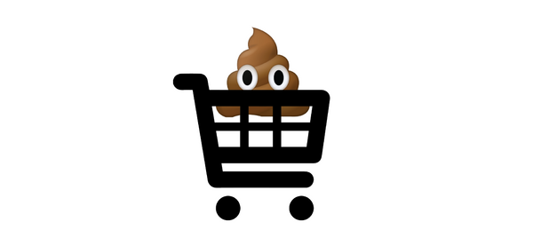

CRUD Store

## Exercise###
This exercise is your first foray into implementing mongoose into your express server. You will be making a CRUD e-store inventory. Use postman to interface with all the items in your database.

### Part One

* Build a new server and connect it to mongodb. <input type="checkbox" checked>
* In a folder called models create a file called inventory.js and define a InventorySchema for items in your store. Export a InventoryModel at the bottom. <input type="checkbox" checked>

### Part Two

* Create a new folder called routes containing a file inventory.js. <input type="checkbox" checked>
* Create all the necessary routes to make a fully CRUD application (GET, GET(one), POST, PUT, DELETE, ). <input type="checkbox" checked>
* Populate your inventory using Postman. Be sure to test each endpoint.
