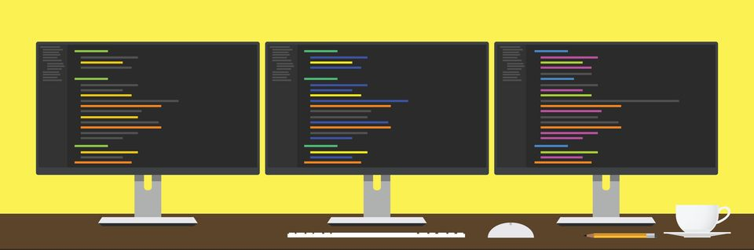
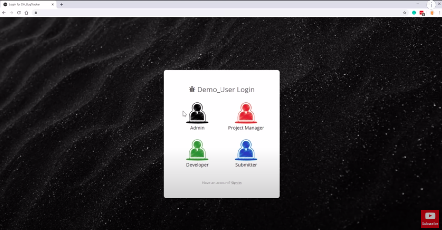
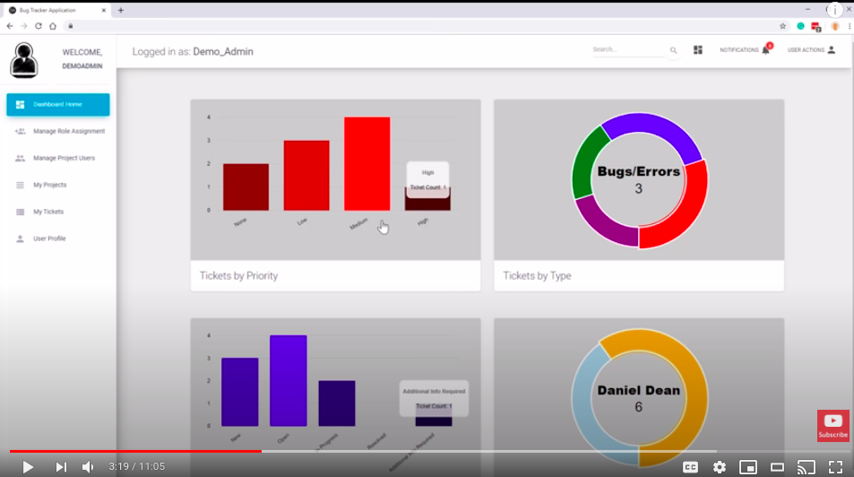
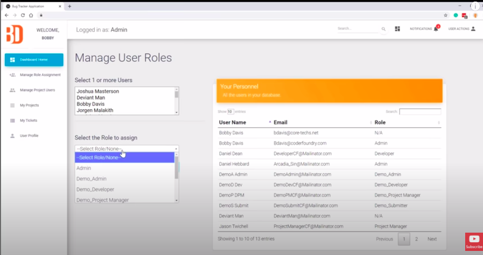
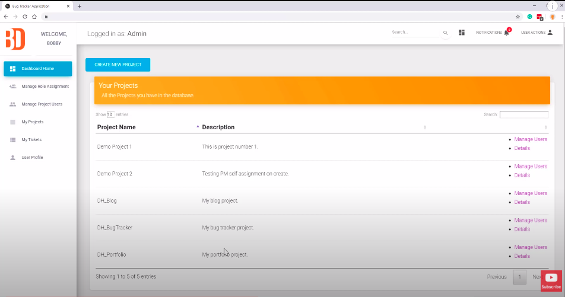
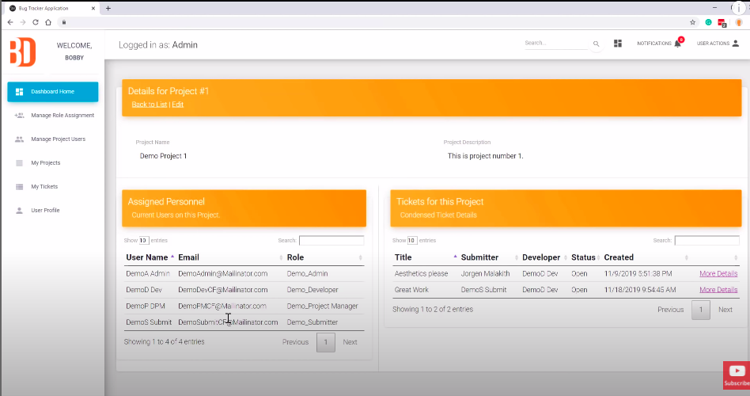
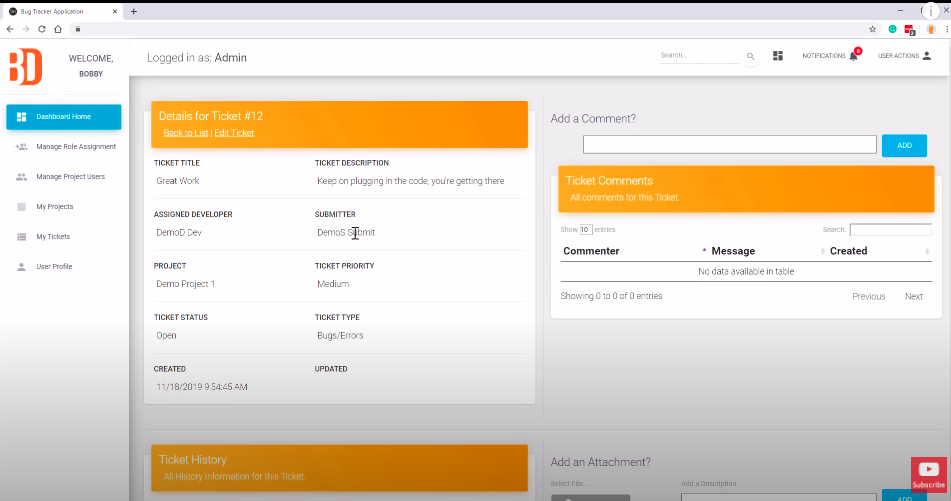
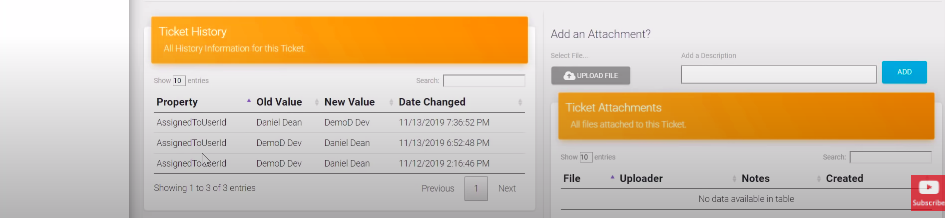
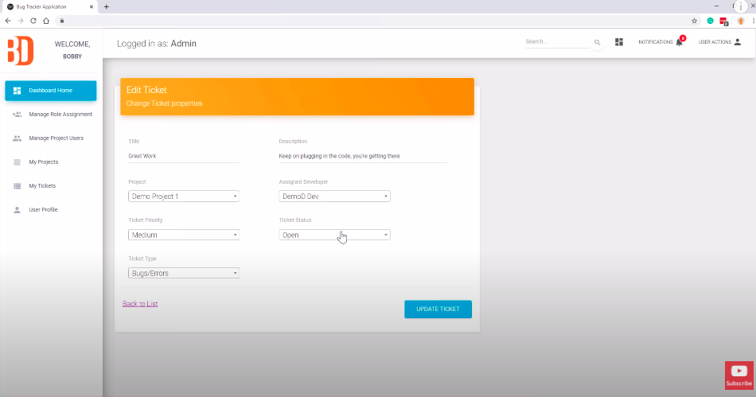
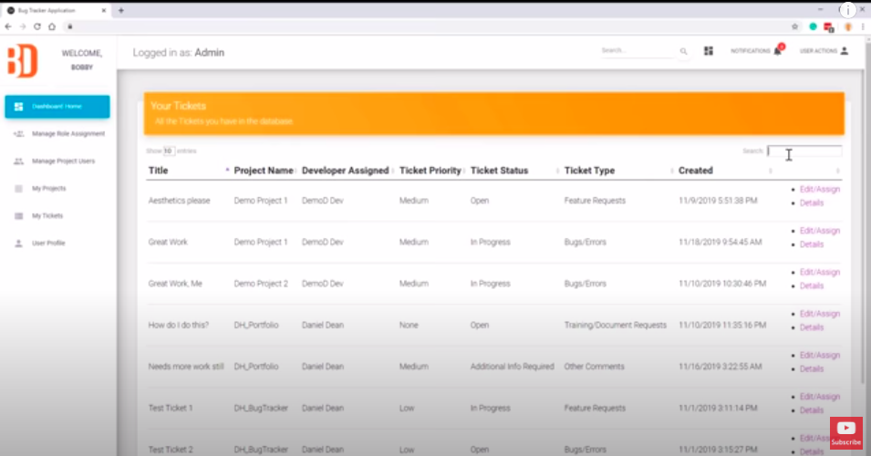

# First Full-Stack Application

This is the last self-directed, larger-scale, full-stack application that you'll build in this course. Up to this point you've learned and practiced everything you need to know in order to build beautiful, data-driven web applications that can provide a real benefit to users. This will be a chance for you to continue to refine your skills, and possibly build something you could turn into a helpful tool for your friends and family, or possibly even a profitable business!

You will have this whole week to work on this project of your choosing.

### Project Requirements
This project needs to be a full-stack web application. As such, it needs to satisfy the following set of requirements:

* A passed-off proposal Explaining your app
* Uses React on the front-end
* Is a single-page application (SPA)
* Is responsive
* Is well organized, using Context and Axios where applicable/useful.
* Uses Node.js/Express as the back-end server
* Shows a good understanding of module patterns by separating components, containers, etc. into their own folders and files
* Uses express routers
* Uses MongoDB for the database and Mongoose for schema creation and the ODM (Object-Document Mapper)
* Has user authentication using json web tokens, express-jwt, bcrypt, and dotenv.
* You also won't necessarily be required to integrate with a third-party API, but you should know that it is one of the best ways to make a really interesting and useful application in a short amount of time.

### Proposal
This part of the project is to help you narrow down your idea, clarify its parts and make it easier to start coding.

The requirements are as follows.

* Paragraph describing your app idea. What are you building? Who is it for?

* An easily describable MVP. Remember you have a limited amount of time to develop this project. What is the minimum you can get done on this project to meet the requirements and get a product in someone's hand?

* User Stories. What is a user going to do when they go to your site from the time they hit the landing page? What features do they need and which are optional?

* Wireframe. What is each page going to look like? What will be the layout, color scheme, etc?

* Mind Map. What is the structure of your backend and frontend app going to look like? What routes, models, components, actions, and reducers will you need? How will your data be organized?

Once you have these items, you need to meet with your instructor to pass off your proposal before you can start coding.

### Passing Criteria: Project Demo to the class
You'll present your finished project to the rest of the class and spend a couple minutes discussing in detail a difficulty (or two) you faced while developing the app and how you ended up solving that problem. The instructors/TAs will be making sure your project satisfied all the requirements outlined above while you are presenting.

Successful completion of this project passes off the following milestones of the skills tree:

* Web Applications - Level 3
* HTTP/APIs - Level 4,
* Databases - Levels 3 & 4

Bug Tracker - I am building this project for myself and for others. It will be used to track my progress and also be able to 

MVP - 

Requirements for MVP - Demo User Logins (4), Admin, Project Manager, Developer, Submitter, (with Have an Account? Sign in) below

Suggested Routes: login, dashboard, manageuserroles, newproject, projectdetails, ticketdetails, tickethistory

+Showing [number] out of [number] files
j

+Showing [number] to [number] of entries (filtered from 10 total entries)
Show all tickets in system if you are an admin. If you are a developer, you would see the tickets just assigned to yourself. If you are a project manager, you are shown all the tickets on a project that you are assigned to.
Ticket Status - New / Open / Resolved / Additional Info Required
Submit for new roles

Search for Users

Roles - Admin

Bug Tracker Ideas - Project, (Collection of Tickets, tickets are the issues, or defects, or feature requests inside the project)