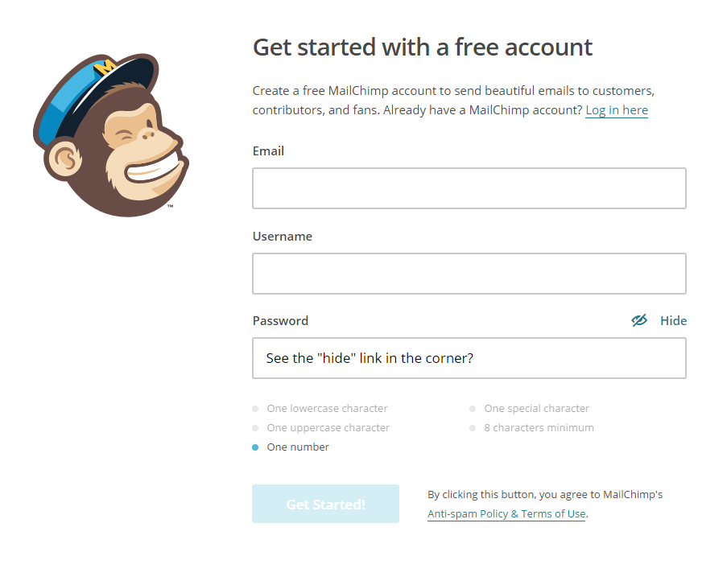
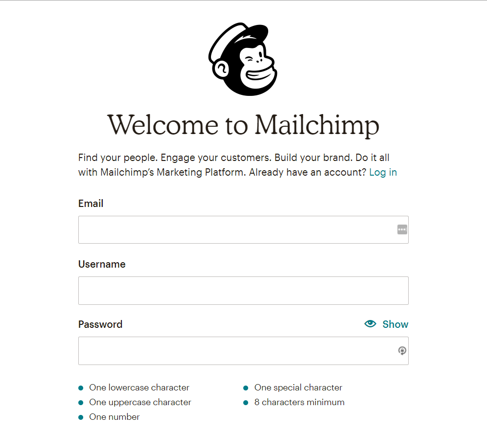
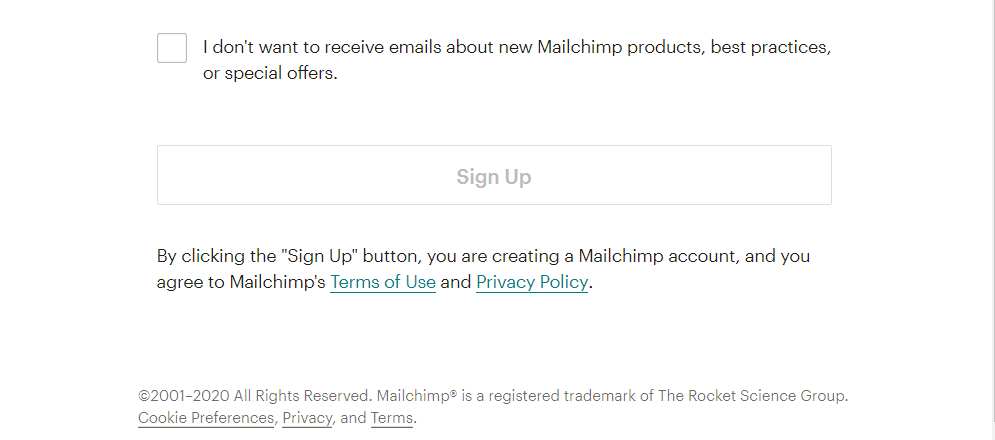
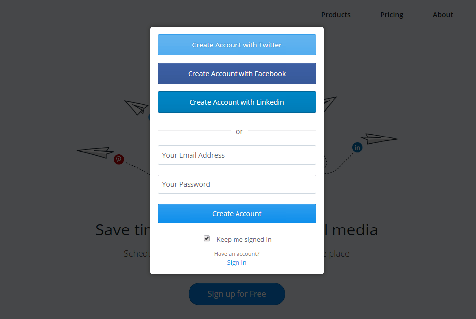

Pro tips: You shouldn't duplicate the e-mail field, because even though you think that it's going to verify the right e-mail, most people just copy from one field to another anyway.

Remind a user why they're here, (at your website)

Summary: Usability suffers when users type in passwords and the only feedback they get is a row of bullets. Typically, masking passwords doesn't even increase security, but it does cost you business due to login failures.

Username: Do your users really need a username to sign up? Or can you just ask for their email, and then let them determine their username once they’ve logged in?
Confirm password: This field is outdated and only necessary because of password masking, another impractical technique.

So, one of the things that I could do is include information on the right-hand side about the website. This could be testimonials, reviews, or just general information about the website, like what the website is for, and light information about how to use the system.

Do a lead-in message to lure them through. 
It's an indication that the form won't take long.

So, basically, in beginner's world, this would be a black border with all white background, but here, we've done a simple enhancement

In this picture, perhaps you could place an eagle or a flag. Notice how it's an image completely separate from the inputs, or in other words, it's not a background. This makes it cleaner and less busy

Here, we aren't really seeing much creativity, but the larger input boxes seem to make the signup process seem more appealing and alluring

Instead of using a “confirm password” field, allow users to see what they’re typing by unmasking the original “password” field, or using a “show/hide” feature, the way MailChimp does on their signup page:

Here's a clever use of an image on the side. 

Here are some images that I could use for inspiration for my signup/login page:

